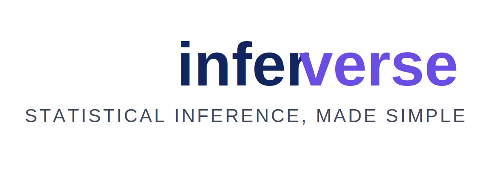

# inferverse

<p align="center">
  
</p>

`inferverse` is a Python-first statistical inference workflow inspired by `tidyverse::infer`.

`inferverse` is currently in beta and built for learners and practitioners who need practical statistical reasoning.
Modern data work needs more than summaries: it needs principled inference to separate signal from noise.
The package makes core statistics workflows reproducible, from hypothesis setup to null-distribution simulation.
It brings inference-friendly verbs into Python so analysts can run rigorous tests without leaving their data pipeline.
By combining approachable syntax with scientific rigor, `inferverse` helps teams make evidence-based decisions with confidence.


## 📘 Introduction to statistical inference

[](https://drive.google.com/file/d/1TWgLDTzn53AvYPF6ZrWSR6N2ZIFyI4x5/view?usp=sharing)


## 🎧 Why statistical inference matters before modeling

[](https://drive.google.com/file/d/1I5SNIrq7WPAM9k6uLPipu9UDWjcq75NB/view?usp=sharing)


## 🧩 Core verbs

- `specify()` — choose response and (optionally) explanatory variables.
- `hypothesize()` — declare a null hypothesis (`independence` or `point`).
- `generate()` — simulate data under the null.
- `calculate()` — compute a statistic for each simulation replicate.
- `visualize()` — create an infer-style Altair histogram and optionally highlight p-value tails.

## 🛠️ Stack

- `polars` for fast DataFrame operations with tidy-like syntax.
- `uv` for dependency management and packaging.
- `scipy` and `statsmodels` for the stats ecosystem.
- `altair` for visualization.

## 🚀 Quick start

Get hands-on with `inferverse` in minutes using the guided Colab notebook.
It walks through the complete inference pipeline—from defining hypotheses to visualizing the null distribution.
Use it if you want a runnable, step-by-step setup before adapting the workflow to your own experiments.

[](https://colab.research.google.com/drive/1U6tYzvFLxvL4jS7lQWmbz6SdIwoRnqAE?usp=sharing)

The minimal example below mirrors the core flow used in the notebook:

```python
import polars as pl
from inferverse import InferPipeline

df = pl.DataFrame({
    "group": ["control", "control", "treat", "treat"],
    "y": [1.1, 0.9, 1.5, 1.7],
})

pipeline = (
    InferPipeline(df)
    .specify(response="y", explanatory="group")
    .hypothesize("independence")
)

null_samples = pipeline.generate(reps=1000, seed=123)
null_distribution = pipeline.calculate(null_samples, stat="diff_in_means")
chart = pipeline.visualize(null_distribution)
```

See `examples.py` for a complete A/B testing workflow and saved chart output, including reusable patterns for real experiment datasets.


## 📚 Documentation

- Module documentation: [`docs/modules.md`](docs/modules.md)
- API reference: [`docs/api.md`](docs/api.md)


## 🎓 Educational Resources

- [Introduction to Modern Statistics (OpenIntro)](https://openintrostat.github.io/ims/)
- [ModernDive (2nd edition)](https://moderndive.com/v2/)


## 🗂️ Cheat Sheet

Use this quick guide to choose common statistical inference tests and understand when to apply each one.
Reference map: [Statistical inference decision map (Coggle)](https://coggle.it/diagram/Vxlydu1akQFeqo6-/t/inference).

| Goal | Typical test | Use when | Key assumptions |
|---|---|---|---|
| Compare one sample mean to a benchmark | One-sample t-test | You have one numeric sample and a hypothesized population mean | Independent observations; approximately normal data (or moderate/large n) |
| Compare two independent group means | Two-sample t-test (Welch) | Numeric outcome for two unrelated groups | Independence; roughly normal within groups; Welch version handles unequal variances |
| Compare paired measurements | Paired t-test | Before/after or matched-pair numeric observations | Pairing is correct; pairwise differences are approximately normal |
| Compare two proportions | Two-proportion z-test | Binary outcome across two independent groups | Independent samples; large enough counts in each group |
| Test association between two categorical variables | Chi-square test of independence | Counts in contingency tables | Independent observations; expected counts sufficiently large |
| Compare means across 3+ groups | One-way ANOVA | Numeric outcome and one categorical factor with 3+ levels | Independence; residuals approximately normal; similar variance across groups |
| Measure linear relationship between two numeric variables | Correlation test (Pearson) | Need strength/direction of linear association | Approximate linearity; no severe outliers; near-normal variables (for inference) |
| Model and test relationship with predictors | Linear regression / logistic regression | Predict numeric (linear) or binary (logistic) outcomes and test coefficients | Independent observations; model form is appropriate; diagnostics acceptable |

> Tip: If assumptions are doubtful, consider robust or non-parametric alternatives (e.g., Mann-Whitney, Wilcoxon, Kruskal-Wallis, Fisher's exact).


## 📄 White paper

Read the white paper here: [AI Challenge 2026 White Paper](https://ciencia-datos.github.io/AI_Challenge_2026/).

## 🗺️ Future roadmap

As `inferverse` evolves beyond beta, we are focusing on features that make statistical inference easier, safer, and more reproducible.
Planned enhancements include broader test coverage, stronger diagnostics, and richer educational workflows for learners and teams.

- **New inference features**: expanded support for additional tests, effect sizes, confidence intervals, and non-parametric workflows.
- **Usability upgrades**: clearer error messages, assumption checks, and helper utilities to choose valid tests faster.
- **Visualization improvements**: more chart styles for null distributions, tail highlighting presets, and export-ready themes.
- **Learning activities**: guided notebooks, scenario-based examples, and classroom-friendly exercises for A/B testing and experimental design.
- **Community & feedback loop**: regular iteration based on user reports, suggestions, and real-world use cases from the beta community.


## 💬 Feedback

Your feedback helps shape the roadmap and usability of `inferverse` during beta.
If you find bugs, confusing docs, or ideas for new inference verbs/tests, please share them.
We especially welcome notes from first-time users following the notebook and quick-start flow.

[](https://forms.gle/3KfUhaC2KSSqENAC9)

## 🏷️ Versioning

Current release: **beta 0.0.1**
